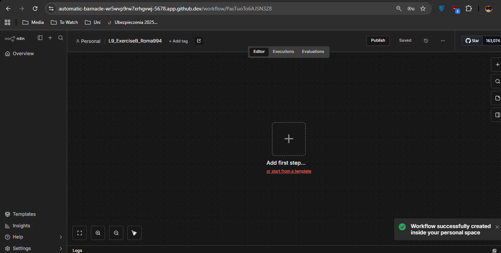
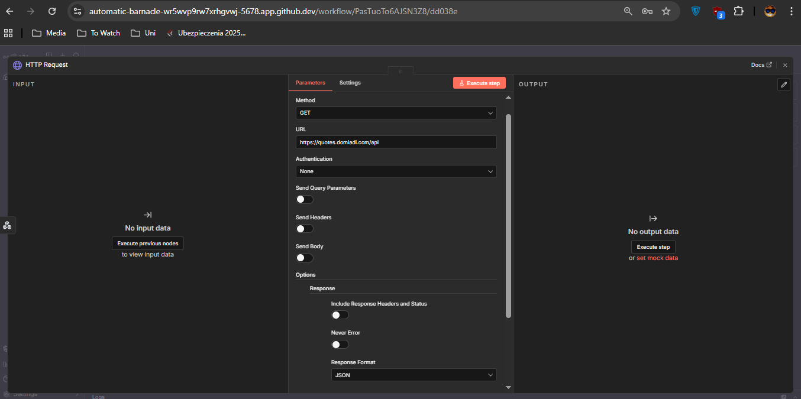
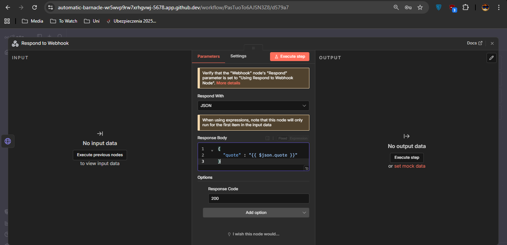
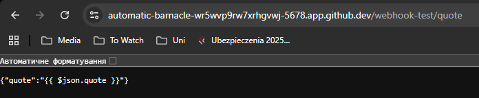

I created a new workflow with a HTTP request, but it says that: "Problem in node ‘HTTP Request
The connection cannot be established, this usually occurs due to an incorrect host (domain) value"; so I made it that it ignores that error and just prints out the code.